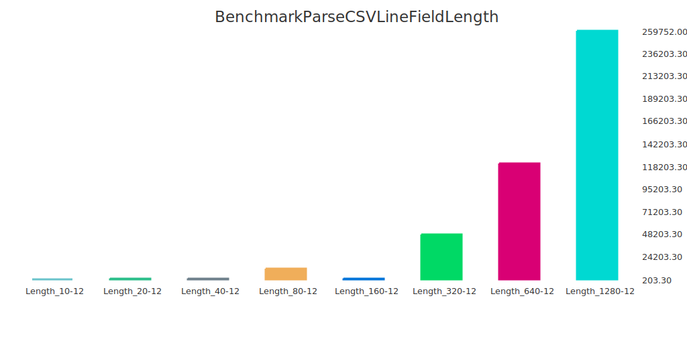

# Go Benchpress
[](https://codecov.io/gh/rpickz/go-benchpress)

Go Benchpress is a visualisation utility for comparing the results of benchmarks.

Benchmarks are a really useful tool for comparing a couple of different strategies for achieving a goal, but also for 
an easy understanding of performance regressions within the system.

Sub-benchmarks are particularly useful for understanding how a particular feature operates over different data-set sizes.

Go Benchpress simplifies visualising these benchmark results - designed particularly for sub-benchmarks and demonstrating
how your code performs at different data-set sizes - visually.

## What Does It Look Like?

Go Benchpress output can look like a variety of things.

Graphically, this is what a Go Benchpress output looks like:



As you can see, it compares all the results for a single benchmark (across its various sub-benchmarks), displaying
their relative values visually.

You can choose between several dimensions (including nanoseconds per operation, bytes per operation, etc.) - for
the most recent advice on this, please consult the help text using:
```bash
gobenchpress -help
```

There are also other formats to choose from - overall the following formats are supported:
1. SVG (as a bar chart)
2. PNG (as a bar chart)
3. JSON
4. CSV
5. XML

See the example [CSV Parser](./examples/csvparser) package for instructions on how to use different formats, and what
they look like.

## How to Install?

Run the following command at a terminal:
```bash
go get github.com/rpickz/go-benchpress/cmd/gobenchpress
```

## How to Use?

See the example [CSV Parser](./examples/csvparser) package for instructions on how to use.

For more detailed instructions, see the CLI usage info with the following:
```bash
gobenchpress -help
```

## License?

MIT License.
